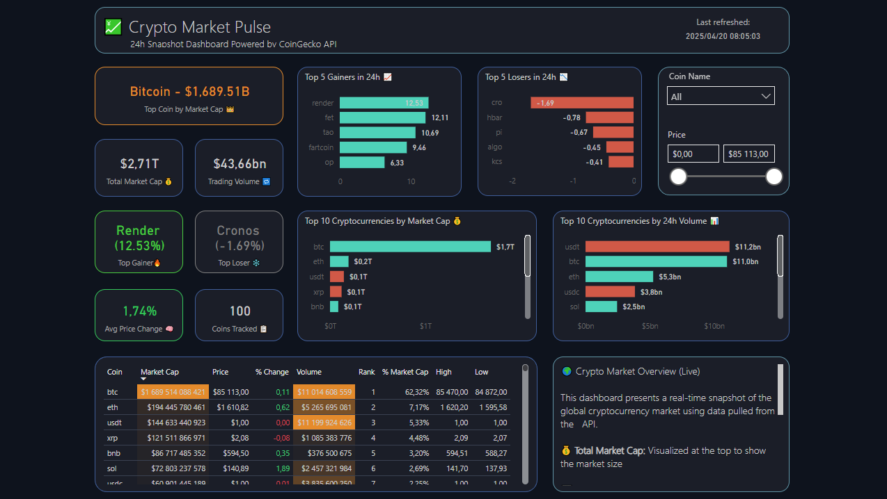

# 📊 Crypto Market Dashboard (Power BI)

An interactive **Power BI dashboard** visualizing real-time cryptocurrency market data using the **CoinGecko API**. This project highlights key market metrics, top-performing coins, and dynamic visuals for professional reporting and insight generation.

---

## 🔍 Overview

This dashboard was built to demonstrate real-time data integration and visual storytelling using Power BI. The data is sourced from the **CoinGecko API** and includes price, market capitalization, volume, and 24-hour change information for the top 100 cryptocurrencies.

---

## 🚀 Features

- ✅ Total Market Capitalization
- 📈 Average Price Change % (24h)
- 💸 Top 10 Cryptocurrencies by Market Cap & Volume
- 🏆 Best & Worst Performing Coins
- 🌍 Filter by noin name and price range
- 📊 Data Tables, KPI Cards, Bar Charts
- 🎨 Conditional Formatting & Dynamic Colors
- 🧠 Summary panel explaining key insights

---

## 📌 Tools Used

- **Power BI Desktop**
- **CoinGecko API**
- **Power Query** for API connection & transformation
- **DAX** for calculated columns and KPIs
- **Custom Conditional Formatting** for visuals

---

## 📸 Screenshots

 

---

## 📁 How to Use

1. Clone or download this repo.
2. Open the `.pbix` file in Power BI Desktop.
3. Click **Refresh** to pull the latest data via API.
4. Explore and modify the visuals as needed.

---

## 🧠 Why This Project?

This is part of my data storytelling and reporting portfolio. I wanted to explore:
- Real-time data integrations
- Professional visual design
- Performance optimization in Power BI
- Turning raw data into decision-making insights

---

## 📫 Let’s Connect

If you found this useful or want to collaborate on more projects:
- 💼 [Connect with me on LinkedIn](https://www.linkedin.com/in/mzukisi-soci/)
- 📬 Drop me a message!

---

## 📜 License

This project is open-source and free to use.

---

